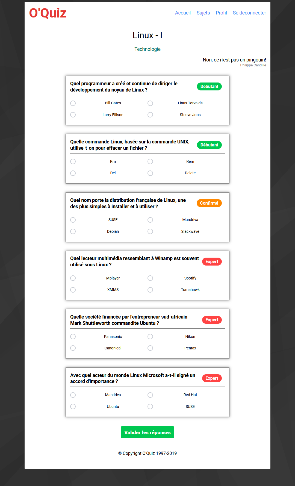
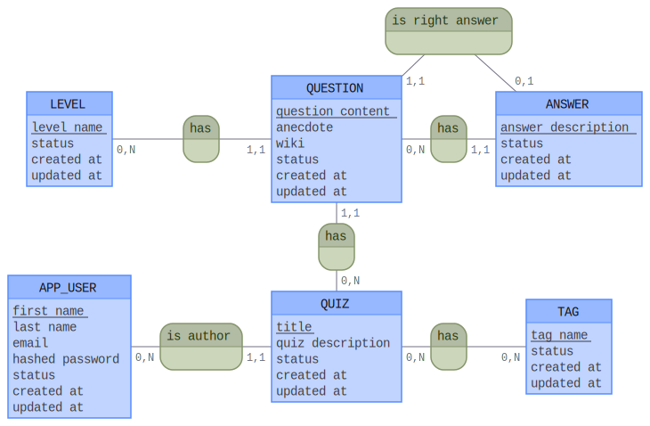

# Quiz

Quiz site created with Lumen, which is a micro-framework based on Laravel.
The site integration is in place and offers a registration and login form as well as a user profile interface. When you are connected, you can answer questions according to several themes and validate your answers.



## Setup

**Download Composer dependencies**

Make sure you have [Composer installed](https://getcomposer.org/download/) and then run:

```
composer install
```

You may alternatively need to run `php composer.phar install`, depending on how you installed Composer.

**Setup the database**

You must import the SQL database with the 'oquiz.sql' file present in the 'docs / database' folder.

**Setup .env**

All you have to do is create a '.env' file on the same model as the '.env.example' file present in the root of the project, completing it with your own information from your database manager.

**Everything is in place! Have fun!**

## Additional docs

- [User Stories](docs/user_stories.md)
- [Routes](docs/routes.md)
- Conceptual data model: 
